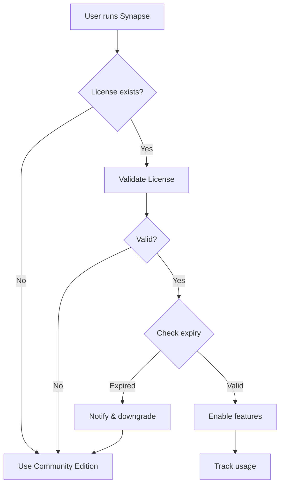

# Publishing Synapse-Lang

## Overview

Synapse-Lang uses a **dual licensing model** similar to Shopify's Liquid and other successful commercial open-source projects:

1. **Community Edition (MIT)** - Free for non-commercial use
2. **Enterprise Edition (Commercial)** - Required for commercial use and advanced features

## Publishing Strategy

### 1. PyPI Package Distribution

```bash
# Build the package
python setup.py sdist bdist_wheel

# Upload to PyPI
pip install twine
twine upload dist/*
```

Users install via:
```bash
# Community Edition (default)
pip install synapse-lang

# Enterprise Edition (with license key)
pip install synapse-lang[enterprise]
synapse-license activate YOUR-KEY-HERE your@email.com
```

### 2. GitHub Repository Structure

```
synapse-lang/
├── synapse_lang/          # Core language (MIT licensed)
│   ├── __init__.py
│   ├── interpreter.py     # Basic interpreter
│   ├── parser.py
│   └── ast.py
├── synapse_enterprise/    # Enterprise features (proprietary)
│   ├── gpu_acceleration.py
│   ├── quantum_net.py
│   └── cloud_integration.py
├── LICENSE-MIT           # Community license
├── LICENSE-COMMERCIAL    # Enterprise license
└── LICENSE-DUAL.md       # Explains dual licensing
```

### 3. License Enforcement Architecture

```python
# Built into the interpreter
@require_feature(FeatureFlag.COMMERCIAL_USE)
def commercial_function():
    """This function requires a commercial license"""
    pass

# Automatic detection
if detect_commercial_use():
    require_license(LicenseType.PROFESSIONAL)
```

### 4. Revenue Model

#### Pricing Tiers

| Edition | Price | Use Case |
|---------|-------|----------|
| Community | Free | Personal, educational, open-source |
| Professional | $99/month | Small teams, commercial use |
| Enterprise | $999/month | Unlimited scale, support, cloud |
| Academic | $199/year | Universities, research |

#### License Features

```python
FEATURE_MATRIX = {
    'community': {
        'max_cores': 4,
        'max_qubits': 30,
        'commercial_use': False,
        'support': 'community',
    },
    'professional': {
        'max_cores': 16,
        'max_qubits': 100,
        'commercial_use': True,
        'support': 'email',
    },
    'enterprise': {
        'max_cores': 'unlimited',
        'max_qubits': 'unlimited',
        'commercial_use': True,
        'support': 'priority',
        'custom_features': True,
    }
}
```

### 5. Distribution Channels

#### A. Package Managers
```bash
# PyPI (Python)
pip install synapse-lang

# Conda (Scientific Python)
conda install -c synapse synapse-lang

# Homebrew (macOS)
brew install synapse-lang

# Docker
docker pull synapselang/synapse:latest
```

#### B. Cloud Platforms
- **AWS Marketplace** - Enterprise AMI with pre-configured clusters
- **Azure Marketplace** - Managed service offering
- **Google Cloud** - Kubernetes operators

#### C. Enterprise Distribution
- Private PyPI server for enterprise customers
- Air-gapped installation packages
- Custom Docker images with license baked in

### 6. License Validation Flow



### 7. Telemetry & Analytics (Enterprise Only)

```python
# Opt-in telemetry for enterprise customers
TELEMETRY = {
    'usage_patterns': ['features_used', 'computation_time'],
    'performance': ['memory_usage', 'cpu_usage'],
    'errors': ['error_types', 'stack_traces'],
}

# Helps improve the product and provide support
```

### 8. Open Source vs Proprietary Balance

#### Open Source (MIT)
- Core language interpreter
- Basic parallel execution
- Standard library
- Documentation
- Examples

#### Proprietary (Commercial License)
- Advanced optimization algorithms
- GPU/TPU acceleration
- Cloud orchestration
- Enterprise integrations
- Priority support
- Custom feature development

### 9. Legal Protection

#### Patents Pending
- Uncertainty propagation through parallel streams
- Quantum-classical reasoning chains
- Symbolic tensor optimization

#### Trade Secrets
- Advanced JIT compilation strategies
- Distributed execution algorithms
- Quantum circuit optimization

#### Trademark
- "Synapse-Lang" and logo are registered trademarks

### 10. Implementation Timeline

**Phase 1: MVP Release (Month 1)**
- Community Edition on PyPI
- Basic license validation
- Documentation site

**Phase 2: Enterprise Features (Month 2-3)**
- GPU acceleration
- Cloud integration
- License server

**Phase 3: Market Expansion (Month 4-6)**
- AWS/Azure marketplace
- Enterprise partnerships
- Academic program

**Phase 4: Ecosystem (Month 6-12)**
- Package ecosystem
- Third-party integrations
- Certification program

## Success Metrics

### Community Adoption
- GitHub stars: Target 1,000 in 6 months
- PyPI downloads: 10,000/month
- Active contributors: 50+

### Commercial Success
- Enterprise customers: 10 in first year
- ARR: $500K by end of year 1
- Retention rate: >90%

## Comparison with Similar Models

### Shopify Liquid
- **Open Source**: Template language core
- **Proprietary**: Shopify platform integration
- **Success**: Powers millions of stores

### Docker
- **Open Source**: Container runtime
- **Proprietary**: Docker Desktop, Docker Hub
- **Success**: $50M+ ARR

### GitLab
- **Open Source**: Core Git platform
- **Proprietary**: Enterprise features
- **Success**: $400M+ ARR, IPO

### Elastic
- **Open Source**: Elasticsearch core
- **Proprietary**: Security, ML features
- **Success**: $600M+ ARR

## Key Differentiators

1. **Unique Technology**: Quantum-classical hybrid computing
2. **Domain Focus**: Scientific computing niche
3. **Patent Protection**: Novel algorithms
4. **Network Effects**: Shared scientific libraries
5. **Enterprise Value**: Faster drug discovery, climate modeling

## Contact

- **Licensing**: licensing@synapse-lang.com
- **Enterprise Sales**: enterprise@synapse-lang.com
- **Support**: support@synapse-lang.com
- **Website**: https://synapse-lang.com