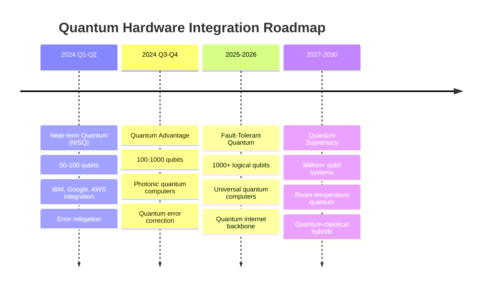

# 🌌 Synapse Quantum Cloud: The AWS of Quantum Computing

**Vision Statement**: Transform Synapse-Lang into the dominant quantum cloud platform that makes quantum computing as accessible as AWS made cloud computing.

---

## 🎯 The Amazon Parallel

### How AWS Revolutionized Computing
- **Before AWS**: Complex infrastructure, massive upfront costs, months to deploy
- **After AWS**: Click-to-deploy, pay-as-you-go, global scale in minutes

### How Synapse Will Revolutionize Quantum Computing
- **Before Synapse**: PhD required, hardware access limited, months to get results
- **After Synapse**: Click-to-quantum, pay-per-shot, quantum algorithms in minutes

---

## 🏗️ Synapse Quantum Cloud Services (SQS)

### Core Infrastructure Services

#### 🚀 **SQ-Compute (Synapse Quantum Compute)**
```bash
# Launch quantum instances like EC2
synapse compute run-instances \
  --quantum-type sq.large.24q \
  --backend-preference "ibm,google,aws" \
  --availability-zone us-quantum-1a
```

**Instance Types:**
- `sq.nano.2q` - 2 qubits, $0.01/shot (learning/testing)
- `sq.small.8q` - 8 qubits, $0.10/shot (development)
- `sq.medium.20q` - 20 qubits, $1.00/shot (production)
- `sq.large.50q` - 50 qubits, $10.00/shot (enterprise)
- `sq.xlarge.100q` - 100+ qubits, $100/shot (research)
- `sq.fault-tolerant` - Error-corrected, $1000/shot (future)

#### 🌐 **SQ-Network (Quantum Internet)**
```bash
# Create quantum VPCs like AWS VPC
synapse network create-qvpc \
  --entanglement-bandwidth 1000 \
  --quantum-subnets us-quantum-1a,eu-quantum-1b
```

#### 💾 **SQ-Storage (Quantum State Storage)**
```bash
# Store quantum states like S3
synapse storage put-quantum-state \
  --bucket my-quantum-experiments \
  --key "bell-state-2024-01-15" \
  --state-vector quantum_state.qsv
```

### Platform Services

#### 🧠 **SQ-AI (Quantum Machine Learning)**
```python
# Managed quantum ML like SageMaker
from synapse_cloud import QuantumSageMaker

qml_endpoint = QuantumSageMaker.deploy(
    algorithm="quantum-neural-network",
    training_data="s3://my-bucket/quantum-data/",
    instance_type="sq.ml.large"
)

predictions = qml_endpoint.predict(new_data)
```

#### 🔬 **SQ-Chemistry (Quantum Chemistry Suite)**
```python
# Managed molecular simulation like AWS Batch
from synapse_cloud import QuantumChemistry

molecule_job = QuantumChemistry.submit_job(
    molecule="caffeine",
    calculation_type="binding_affinity",
    target_protein="adenosine_receptor",
    accuracy="pharmaceutical_grade"
)
```

#### 💰 **SQ-Finance (Quantum Finance Services)**
```python
# Quantum risk analysis like AWS FinSpace
from synapse_cloud import QuantumFinance

risk_analysis = QuantumFinance.monte_carlo_var(
    portfolio=portfolio_data,
    confidence_level=0.99,
    time_horizon=30,
    quantum_acceleration=True
)
```

#### 🎓 **SQ-Education (Quantum Learning Platform)**
```python
# Educational quantum computing like AWS Educate
from synapse_cloud import QuantumEducate

classroom = QuantumEducate.create_classroom(
    course="Introduction to Quantum Computing",
    students=50,
    quantum_simulators=True,
    hardware_access="limited"
)
```

---

## 🌍 Global Quantum Infrastructure

### Quantum Availability Zones
```yaml
Quantum Regions:
  us-quantum-1: # United States East
    availability_zones:
      - us-quantum-1a: # IBM Quantum Network
        hardware: ["ibm_brisbane", "ibm_kyoto"]
        qubits: 127
      - us-quantum-1b: # Google Quantum AI
        hardware: ["google_sycamore", "google_bristlecone"]
        qubits: 70
      - us-quantum-1c: # AWS Braket
        hardware: ["rigetti_aspen", "ionq_harmony"]
        qubits: 32

  eu-quantum-1: # Europe
    availability_zones:
      - eu-quantum-1a: # Oxford Quantum Computing
        hardware: ["oxford_lucy"]
        qubits: 8
      - eu-quantum-1b: # Cambridge Quantum Computing
        hardware: ["cambridge_h1"]
        qubits: 20

  asia-quantum-1: # Asia Pacific
    availability_zones:
      - asia-quantum-1a: # China Quantum Network
        hardware: ["ustc_zuchongzhi"]
        qubits: 66
      - asia-quantum-1b: # Japan Quantum Network
        hardware: ["riken_quantum"]
        qubits: 40
```

### Quantum CDN (Content Delivery Network)
```bash
# Distribute quantum algorithms globally
synapse cdn deploy \
  --algorithm grover-search \
  --regions all \
  --cache-policy quantum-states \
  --edge-optimization true
```

---

## 💻 Developer Experience Revolution

### 🎮 **Synapse Quantum Console**
```typescript
// AWS-style management console for quantum computing
interface QuantumConsole {
  dashboard: {
    activeJobs: QuantumJob[];
    costThisMonth: Currency;
    quantumCreditsUsed: number;
    errorRates: MetricData[];
  };
  
  services: {
    compute: QuantumComputeService;
    storage: QuantumStorageService;
    networking: QuantumNetworkService;
    ai: QuantumAIService;
    marketplace: QuantumMarketplace;
  };
  
  monitoring: {
    quantumCloudWatch: QuantumMetrics;
    quantumTracing: QuantumXRay;
    quantumLogs: QuantumLogs;
  };
}
```

### 📱 **Synapse CLI (like AWS CLI)**
```bash
# Configure quantum credentials
synapse configure
# AWS CLI:     aws configure
# Synapse CLI: synapse configure

# List quantum instances
synapse sq compute describe-instances
# AWS: aws ec2 describe-instances
# Synapse: synapse sq compute describe-instances

# Deploy quantum application
synapse deploy --template quantum-portfolio-optimizer.yaml
# AWS: aws cloudformation deploy --template-file template.yaml
# Synapse: synapse deploy --template quantum-app.yaml

# Monitor quantum jobs
synapse logs tail /synapse/quantum/jobs/grover-search
# AWS: aws logs tail /aws/lambda/my-function
# Synapse: synapse logs tail /synapse/quantum/jobs/my-algorithm
```

### 🛠️ **Quantum SDKs for Every Language**
```python
# Python SDK (like boto3)
from synapse_sdk import QuantumClient

quantum = QuantumClient(
    region='us-quantum-1',
    quantum_access_key='SQAIA...',
    quantum_secret_key='wJal...'
)

# Launch quantum computation
response = quantum.compute.run_circuit(
    Circuit=quantum_circuit,
    Shots=1000,
    Backend='auto',
    Billing='on-demand'
)
```

```javascript
// JavaScript SDK
const { QuantumClient } = require('synapse-sdk');

const quantum = new QuantumClient({
  region: 'us-quantum-1',
  credentials: {
    accessKeyId: 'SQAIA...',
    secretAccessKey: 'wJal...'
  }
});

// Execute quantum algorithm
const result = await quantum.ai.trainQuantumModel({
  algorithm: 'quantum-svm',
  trainingData: 's3://my-bucket/training-data',
  hyperparameters: {
    learningRate: 0.01,
    quantumDepth: 6
  }
});
```

---

## 🏪 Quantum Marketplace & Ecosystem

### 📦 **Synapse Quantum Marketplace**
```yaml
Marketplace Categories:
  Algorithms:
    - "Grover's Search Optimization" by IBM ($0.50/execution)
    - "Quantum Portfolio Optimizer" by Goldman Sachs ($5.00/portfolio)
    - "Molecular Docking Suite" by Roche ($25.00/molecule)
  
  Datasets:
    - "Quantum Chemistry Benchmark Dataset" ($100/month)
    - "Financial Time Series for QML" ($500/month)
    - "Protein Folding Quantum States" ($1000/month)
  
  Tools:
    - "Quantum Circuit Visualizer Pro" ($20/month)
    - "Quantum Error Correction Simulator" ($100/month)
    - "Quantum Advantage Analyzer" ($200/month)
  
  Templates:
    - "Drug Discovery Pipeline" (Free)
    - "Risk Analysis Framework" ($50/month)
    - "Quantum AI Starter Kit" ($30/month)
```

### 🔌 **Partner Ecosystem**
```python
# Third-party quantum services integration
from synapse_cloud.partners import (
    IBMQuantumNetwork,
    GoogleQuantumAI,
    AWSBraket,
    MicrosoftAzureQuantum,
    PennyLaneAI,
    XanaduPhotonic
)

# Unified interface to all quantum providers
quantum_hub = QuantumHub()
quantum_hub.register_providers([
    IBMQuantumNetwork(api_key="..."),
    GoogleQuantumAI(credentials="..."),
    AWSBraket(region="us-east-1")
])

# Auto-route to best available quantum computer
result = quantum_hub.execute(
    circuit=my_circuit,
    optimization_level="cost",  # or "speed" or "accuracy"
    fallback_strategy="classical_simulation"
)
```

---

## 💰 Quantum Economics Model

### 🏷️ **Pay-As-You-Quantum Pricing**
```yaml
Pricing Models:
  On-Demand:
    - Pay per quantum shot
    - No upfront costs
    - Scale automatically
    - "$0.001 - $100 per shot depending on complexity"
  
  Quantum Reserved Instances:
    - 1-3 year commitments
    - Up to 75% savings
    - Guaranteed quantum time slots
    - "Reserve 1000 shots/month at 50% discount"
  
  Quantum Spot Instances:
    - Bid for unused quantum capacity
    - Up to 90% savings
    - Interruptible workloads
    - "Run optimization jobs when quantum computers idle"
  
  Enterprise Agreements:
    - Custom quantum commitments
    - Dedicated quantum support
    - Private quantum clouds
    - "$1M+ annual quantum computing agreements"
```

### 📊 **Quantum Cost Optimization**
```python
# Quantum cost optimization tools
from synapse_cloud import QuantumCostOptimizer

optimizer = QuantumCostOptimizer()

# Analyze quantum spending
cost_analysis = optimizer.analyze_usage(
    time_period="last_30_days",
    breakdown_by=["service", "algorithm", "backend"]
)

# Get cost reduction recommendations
recommendations = optimizer.get_recommendations([
    "use_spot_instances_for_batch_jobs",
    "optimize_circuit_depth",
    "use_classical_preprocessing",
    "schedule_jobs_during_off_peak"
])

# Implement automatic cost controls
optimizer.set_billing_alerts(
    monthly_limit=1000,  # $1000/month
    alert_thresholds=[50, 80, 95],  # Alert at 50%, 80%, 95%
    auto_pause_at=100  # Pause at 100% of budget
)
```

---

## 🔒 Enterprise Security & Compliance

### 🛡️ **Quantum Security Model**
```python
# Enterprise-grade quantum security
from synapse_cloud import QuantumSecurity

security = QuantumSecurity()

# Quantum Identity and Access Management (QIAM)
quantum_policy = {
    "Version": "2024-01-01",
    "Statement": [{
        "Effect": "Allow",
        "Principal": {"User": "quantum-researcher"},
        "Action": [
            "synapse:quantum:ExecuteCircuit",
            "synapse:quantum:ReadResults"
        ],
        "Resource": "arn:synapse:quantum:us-quantum-1:*:circuit/research-*",
        "Condition": {
            "QuantumComplexity": {"LessThan": 20},  # Max 20 qubits
            "ShotsPerDay": {"LessThan": 10000}      # Max 10k shots/day
        }
    }]
}

# Quantum data encryption
encryption = security.create_quantum_encryption(
    algorithm="post_quantum_cryptography",
    key_management="quantum_key_distribution",
    compliance=["SOC2", "HIPAA", "FedRAMP"]
)
```

### 📋 **Compliance & Governance**
```yaml
Compliance Frameworks:
  Government:
    - FedRAMP (US Federal)
    - ITAR (Export Control)
    - NIST Quantum Standards
  
  Healthcare:
    - HIPAA (Patient Data)
    - FDA 21 CFR Part 11 (Drug Discovery)
  
  Financial:
    - SOX (Financial Reporting)
    - PCI DSS (Payment Data)
    - Basel III (Risk Management)
  
  International:
    - GDPR (EU Privacy)
    - ISO 27001 (Security)
    - SOC 2 Type II (Service Organization)
```

---

## 📈 Go-To-Market Strategy

### 🎯 **Phase 1: Capture Early Adopters (Months 1-6)**
```yaml
Target Segments:
  Quantum Researchers:
    - Universities with quantum programs
    - National labs (NIST, CERN, etc.)
    - Quantum computing startups
    
  Strategy:
    - Free tier with generous limits
    - Academic pricing (90% discount)
    - Quantum research grants program
    - Open source algorithm library
```

### 🏢 **Phase 2: Enterprise Adoption (Months 6-18)**
```yaml
Target Enterprises:
  Financial Services:
    - Goldman Sachs, JP Morgan (Risk Analysis)
    - Visa, Mastercard (Fraud Detection)
    - BlackRock, Vanguard (Portfolio Optimization)
  
  Pharmaceuticals:
    - Pfizer, Roche (Drug Discovery)
    - Johnson & Johnson (Molecular Simulation)
    - Moderna (Protein Folding)
  
  Technology:
    - Google, Microsoft (Quantum AI)
    - Intel, NVIDIA (Quantum Hardware)
    - AWS, IBM (Quantum Cloud Services)
  
  Strategy:
    - Proof-of-concept programs
    - White-glove onboarding
    - Custom quantum solutions
    - Enterprise support contracts
```

### 🌍 **Phase 3: Global Dominance (Months 18-36)**
```yaml
Global Expansion:
  Quantum Hubs:
    - North America: IBM Quantum Network
    - Europe: Cambridge/Oxford Quantum
    - Asia: China/Japan Quantum Networks
    - Australia: Silicon Quantum Computing
  
  Government Partnerships:
    - US National Quantum Initiative
    - EU Quantum Flagship
    - China National Quantum Program
    - UK National Quantum Computing Centre
  
  Strategy:
    - Localized quantum infrastructure
    - Government cloud certifications
    - Sovereign quantum computing options
    - International standards leadership
```

---

## 🚀 Technology Roadmap

### 🔬 **Quantum Hardware Evolution**


### 🧠 **AI Integration Evolution**
```python
# Quantum-AI convergence roadmap
class QuantumAIEvolution:
    def phase_1_quantum_ml(self):
        """Current: Quantum machine learning algorithms"""
        return [
            "Quantum neural networks",
            "Quantum support vector machines",
            "Quantum reinforcement learning"
        ]
    
    def phase_2_ai_optimized_quantum(self):
        """2024-2025: AI optimizes quantum computing"""
        return [
            "AI-designed quantum circuits",
            "ML-based error correction",
            "Intelligent quantum compilation"
        ]
    
    def phase_3_quantum_enhanced_ai(self):
        """2025-2027: Quantum accelerates AI"""
        return [
            "Quantum-accelerated training",
            "Quantum sampling for ML",
            "Quantum generative models"
        ]
    
    def phase_4_quantum_agi(self):
        """2027+: Quantum artificial general intelligence"""
        return [
            "Quantum consciousness models",
            "Quantum-classical hybrid minds",
            "Universal quantum intelligence"
        ]
```

---

## 💎 Competitive Advantages

### 🎯 **Why Synapse Will Win**

#### **1. Developer Experience First**
```bash
# Synapse: One command quantum deployment
synapse deploy quantum-portfolio-optimizer

# vs. Current quantum platforms: Complex setup
# 1. Install vendor SDK
# 2. Learn vendor-specific APIs
# 3. Manage quantum circuit compilation
# 4. Handle hardware-specific constraints
# 5. Debug quantum-specific errors
```

#### **2. Hardware Agnostic**
```python
# Synapse: Write once, run anywhere
result = quantum.execute(
    circuit=my_algorithm,
    backend="auto",  # Automatically selects best hardware
    optimization="cost"  # or "speed" or "accuracy"
)

# vs. Competitors: Vendor lock-in
# IBM Qiskit: Only IBM hardware
# Google Cirq: Only Google hardware
# AWS Braket: Limited hardware partners
```

#### **3. Classical-Quantum Hybrid by Default**
```python
# Synapse: Seamless hybrid computing
@quantum_classical_hybrid
def optimize_portfolio(assets, risk_tolerance):
    # Classical preprocessing
    processed_data = classical_preprocess(assets)
    
    # Quantum optimization
    quantum_result = quantum_optimize(processed_data)
    
    # Classical postprocessing
    return classical_postprocess(quantum_result)

# Result: Best of both worlds automatically
```

#### **4. Enterprise Ready from Day One**
- **Security**: Post-quantum cryptography, quantum key distribution
- **Compliance**: SOC2, HIPAA, FedRAMP, GDPR ready
- **Scale**: Multi-region, auto-scaling, 99.99% uptime SLA
- **Support**: 24/7 quantum engineering support

---

## 📊 Success Metrics

### 🎯 **Year 1 Goals (2024)**
```yaml
Technical Metrics:
  - 100+ quantum algorithms in marketplace
  - 10+ quantum hardware providers integrated
  - 99.9% platform uptime
  - <1 second average job queue time

Business Metrics:
  - 10,000+ registered developers
  - 100+ enterprise customers
  - $10M ARR (Annual Recurring Revenue)
  - 50+ countries with active users

Ecosystem Metrics:
  - 1,000+ third-party quantum packages
  - 100+ partner integrations
  - 10+ quantum unicorn startups using platform
  - 50+ universities teaching with Synapse
```

### 🚀 **Year 3 Vision (2027)**
```yaml
Market Leadership:
  - #1 quantum cloud platform globally
  - 1M+ active developers
  - 10,000+ enterprise customers
  - $1B+ annual revenue

Technical Dominance:
  - 1000+ qubit quantum computers
  - Fault-tolerant quantum error correction
  - Quantum internet backbone
  - Quantum AGI research platform

Ecosystem Maturity:
  - 100,000+ quantum applications
  - Quantum app stores for industries
  - Quantum computing certification standards
  - Global quantum developer conference
```

---

## 🎉 The Quantum Future Starts Now

**Synapse-Lang is positioned to become the AWS of quantum computing by:**

✅ **Making quantum computing as easy as clicking "Deploy"**
✅ **Providing enterprise-grade security and compliance**
✅ **Creating a thriving quantum ecosystem and marketplace**
✅ **Offering the most developer-friendly quantum platform**
✅ **Enabling seamless classical-quantum hybrid computing**

**The quantum revolution needs its AWS moment. Synapse-Lang will be that moment.** 🌌⚛️

---

*"Just as AWS democratized cloud computing, Synapse will democratize quantum computing. The future is quantum, and it starts with Synapse."*