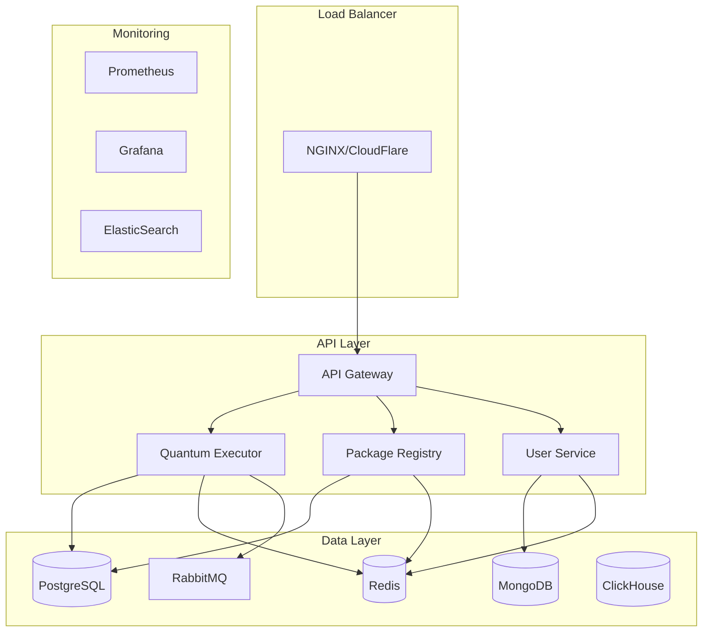

# 🚀 Synapse Cloud Platform

**Enterprise-grade quantum computing platform with microservices architecture**

A complete cloud-native quantum computing platform that provides distributed quantum circuit execution, package management, user authentication, and enterprise features.

## 🏗️ Architecture Overview



## 🔧 Services

### API Gateway (`api-gateway/`)
- **Purpose**: Central entry point for all client requests
- **Technology**: FastAPI, Python 3.11
- **Features**:
  - Authentication & authorization
  - Request routing and load balancing
  - Rate limiting and throttling
  - API versioning and documentation
  - Health checks and monitoring

### Quantum Executor (`quantum-executor/`)
- **Purpose**: Distributed quantum circuit execution engine
- **Technology**: Python, Ray, Qiskit, Cirq, PennyLane
- **Features**:
  - Multi-backend quantum simulation
  - GPU-accelerated execution
  - Distributed computing with Ray
  - Circuit optimization
  - Hardware backend integration

### Package Registry (`package-registry/`)
- **Purpose**: Centralized package management for quantum algorithms
- **Technology**: FastAPI, PostgreSQL, S3/MinIO
- **Features**:
  - Package upload and download
  - Version management
  - Security scanning
  - Dependency resolution
  - Search and discovery

### User Service (`user-service/`)
- **Purpose**: User management and subscription handling
- **Technology**: FastAPI, MongoDB, Stripe
- **Features**:
  - User authentication (JWT)
  - Subscription management
  - Team and organization support
  - Billing integration
  - Role-based access control

## 🚀 Quick Start

### Prerequisites
- Docker 20.10+
- Docker Compose 2.0+
- Python 3.11+
- 8GB+ RAM
- 50GB+ storage

### Development Setup

1. **Clone and Setup**
   ```bash
   cd synapse-lang/cloud-platform
   cp .env.example .env
   # Edit .env with your configuration
   ```

2. **Deploy Development Environment**
   ```bash
   chmod +x deploy.sh
   ./deploy.sh development
   ```

3. **Access Services**
   - API Gateway: http://localhost:8000
   - Package Registry: http://localhost:8001
   - Grafana Dashboard: http://localhost:3000 (admin/admin)
   - Prometheus: http://localhost:9090
   - RabbitMQ Management: http://localhost:15672

### Production Deployment

1. **Kubernetes Cluster Setup**
   ```bash
   # AWS EKS
   eksctl create cluster --name synapse-platform --region us-west-2
   
   # Google GKE
   gcloud container clusters create synapse-platform --zone us-west1-a
   
   # Azure AKS
   az aks create --resource-group synapse-rg --name synapse-platform
   ```

2. **Deploy to Production**
   ```bash
   ./deploy.sh production us-west-2
   ```

## 📊 API Documentation

### Authentication
All API endpoints require JWT authentication. Obtain a token by logging in:

```bash
curl -X POST http://localhost:8000/api/v1/auth/login \
  -H "Content-Type: application/json" \
  -d '{"email": "user@example.com", "password": "password"}'
```

### Quantum Circuit Execution

```bash
# Submit quantum job
curl -X POST http://localhost:8000/api/v1/quantum/execute \
  -H "Authorization: Bearer YOUR_JWT_TOKEN" \
  -H "Content-Type: application/json" \
  -d '{
    "code": "circuit = QuantumCircuit(2); circuit.h(0); circuit.cx(0,1)",
    "language": "qiskit",
    "backend": "qiskit_statevector",
    "shots": 1000
  }'

# Get job results
curl -X GET http://localhost:8000/api/v1/quantum/job/{job_id} \
  -H "Authorization: Bearer YOUR_JWT_TOKEN"
```

### Package Management

```bash
# Search packages
curl -X POST http://localhost:8001/api/v1/packages/search \
  -H "Content-Type: application/json" \
  -d '{"query": "grover", "limit": 10}'

# Download package
curl -X GET http://localhost:8001/api/v1/packages/quantum-grover/1.0.0/download \
  -o grover-1.0.0.tar.gz
```

## 🔒 Security Features

- **JWT Authentication**: Secure token-based authentication
- **Role-Based Access Control**: Fine-grained permissions
- **API Rate Limiting**: Protection against abuse
- **Package Security Scanning**: Automated vulnerability detection
- **Encrypted Communications**: TLS/SSL everywhere
- **Audit Logging**: Complete activity tracking

## 📈 Monitoring & Observability

### Metrics
- **Application Metrics**: Request rates, response times, error rates
- **Quantum Metrics**: Job queue depth, execution times, success rates
- **Infrastructure Metrics**: CPU, memory, disk, network usage
- **Business Metrics**: User registrations, package downloads, revenue

### Dashboards
- **Platform Overview**: High-level system health
- **Quantum Performance**: Circuit execution analytics
- **User Analytics**: Usage patterns and engagement
- **Infrastructure**: Resource utilization and capacity

### Alerting
- **Critical**: Service outages, data loss, security breaches
- **Warning**: High error rates, resource exhaustion
- **Info**: Deployment events, scaling activities

## 🔧 Configuration

### Environment Variables
See `.env.example` for complete configuration options:

- **Security**: JWT secrets, API keys
- **Databases**: Connection strings, credentials
- **External Services**: AWS, Stripe, monitoring
- **Feature Flags**: Enable/disable functionality
- **Performance**: Worker counts, timeouts

### Scaling Configuration

```yaml
# Horizontal Pod Autoscaler
apiVersion: autoscaling/v2
kind: HorizontalPodAutoscaler
metadata:
  name: quantum-executor-hpa
spec:
  scaleTargetRef:
    apiVersion: apps/v1
    kind: Deployment
    name: quantum-executor
  minReplicas: 3
  maxReplicas: 50
  metrics:
  - type: Resource
    resource:
      name: cpu
      target:
        type: Utilization
        averageUtilization: 70
  - type: Resource
    resource:
      name: memory
      target:
        type: Utilization
        averageUtilization: 80
```

## 🧪 Testing

### Unit Tests
```bash
# Run all unit tests
python -m pytest tests/unit/ -v

# Run specific service tests
python -m pytest tests/unit/test_quantum_executor.py -v
```

### Integration Tests
```bash
# Run integration tests
python -m pytest tests/integration/ -v

# Run end-to-end tests
python -m pytest tests/e2e/ -v
```

### Load Testing
```bash
# Quantum execution load test
python tests/load/test_quantum_execution.py

# API gateway load test
locust -f tests/load/locustfile.py --host=http://localhost:8000
```

## 💰 Subscription Tiers

| Feature | Community | Professional | Enterprise | Academic |
|---------|-----------|--------------|------------|----------|
| **Price** | Free | $299/month | $2,999/month | $99/month |
| **Max Qubits** | 5 | 20 | 50 | 15 |
| **Monthly Quota** | 1,000 | 10,000 | 100,000 | 5,000 |
| **GPU Access** | ❌ | ✅ | ✅ | ✅ |
| **Hardware Access** | ❌ | ❌ | ✅ | ❌ |
| **Support** | Community | Priority | Dedicated | Standard |
| **Team Features** | ❌ | Limited | Full | ✅ |

## 🔄 CI/CD Pipeline

### GitHub Actions Workflow
```yaml
name: Deploy Synapse Platform
on:
  push:
    branches: [main]
  pull_request:
    branches: [main]

jobs:
  test:
    runs-on: ubuntu-latest
    steps:
      - uses: actions/checkout@v3
      - name: Run tests
        run: |
          docker-compose -f docker-compose.test.yml up --abort-on-container-exit

  deploy:
    needs: test
    runs-on: ubuntu-latest
    if: github.ref == 'refs/heads/main'
    steps:
      - uses: actions/checkout@v3
      - name: Deploy to staging
        run: |
          ./deploy.sh staging
      - name: Run smoke tests
        run: |
          ./deploy.sh staging us-west-2 test
```

## 📝 Development Guide

### Adding a New Service
1. Create service directory: `my-service/`
2. Implement FastAPI application: `my-service/main.py`
3. Add Dockerfile: `my-service/Dockerfile`
4. Update docker-compose.yml
5. Add monitoring endpoints
6. Write tests
7. Update documentation

### Database Migrations
```bash
# Create migration
alembic revision --autogenerate -m "Add new table"

# Run migrations
alembic upgrade head

# Rollback migration
alembic downgrade -1
```

### Adding New Quantum Backends
```python
# quantum-executor/backends/my_backend.py
from .base import QuantumBackend

class MyQuantumBackend(QuantumBackend):
    def __init__(self):
        super().__init__(name="my_backend")
    
    async def execute(self, circuit, shots=1000):
        # Implementation here
        return results
```

## 🚨 Troubleshooting

### Common Issues

**Service won't start**
```bash
# Check logs
docker-compose logs service-name

# Check environment variables
docker-compose config

# Restart service
docker-compose restart service-name
```

**Database connection issues**
```bash
# Check database status
docker-compose ps postgres

# Connect to database
docker-compose exec postgres psql -U synapse -d synapse

# Reset database
docker-compose down -v
docker-compose up -d postgres
```

**Quantum job failures**
```bash
# Check executor logs
docker-compose logs quantum-executor

# Check job status
curl -X GET http://localhost:8000/api/v1/quantum/job/{job_id}

# Check RabbitMQ queue
docker-compose exec rabbitmq rabbitmqctl list_queues
```

### Performance Optimization

1. **Database Tuning**
   - Connection pooling
   - Query optimization
   - Indexing strategies

2. **Caching Strategy**
   - Redis for session storage
   - Application-level caching
   - CDN for static assets

3. **Quantum Executor Scaling**
   - Horizontal scaling with Ray
   - GPU utilization optimization
   - Circuit optimization

## 🤝 Contributing

1. Fork the repository
2. Create feature branch: `git checkout -b feature/amazing-feature`
3. Commit changes: `git commit -m 'Add amazing feature'`
4. Push to branch: `git push origin feature/amazing-feature`
5. Open Pull Request

### Code Style
- Python: Black formatting, flake8 linting
- TypeScript: Prettier formatting, ESLint
- Commit messages: Conventional Commits format

## 📞 Support

- **Documentation**: https://docs.synapse-lang.org
- **Discord**: https://discord.gg/synapse-lang
- **GitHub Issues**: https://github.com/MichaelCrowe11/synapse-lang/issues
- **Email**: support@synapse-lang.org

## 📄 License

Dual licensed under MIT (open source) and Commercial licenses.
See [LICENSE](LICENSE) for details.

---

**Built with ❤️ for the quantum computing community**

*Making quantum computing accessible to everyone* 🚀