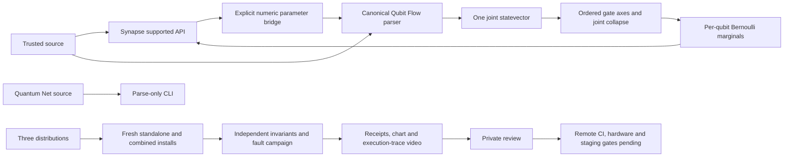

# Trinity private implementation blueprint

## Scope and decision

Continuation of the interrupted review on branch `optimize-runtime-e2e` in
`/Users/crowelogic/Projects/crios-nova/synapse-lang`.
This pass implements and verifies the local foundation milestone. It is not a
complete production rollout. No source push, remote workflow dispatch, registry
publication, product deployment, hardware job or announcement was performed.
The working tree already contained extensive uncommitted work; no blanket commit
or cleanup was performed.

## Implemented architecture



### Canonical packaging

- `qubit-flow-package/qubit_flow_lang/` is the authoritative Qubit Flow source.
- Package-relative imports replace checkout-dependent imports.
- Root `qubit_flow_*.py` files are compatibility re-exports. The root package
  routes checkout imports to the canonical companion directory.
- Synapse packaging excludes the companion placeholder packages, preventing a
  later Synapse install from overwriting Qubit Flow's installed package.
- Qubit Flow's old setup script copied root modules into its package during build.
  The first isolated gate exposed this destructive side effect. It was removed;
  the setup shim now delegates to `pyproject.toml` without copying source.
- Companion metadata now requires Python 3.10 or later, matching used syntax.
- Existing version numbers and license selections were not changed. These local
  artifacts are not newly versioned release candidates.
- Optional hardware libraries remain existing distribution dependencies; their
  installation does not constitute hardware validation.

### Shared quantum state

Every declared qubit has an index in one interpreter-owned statevector. Index
zero is the most significant bit. Register objects reference that same state,
not an invalid independent pure-state approximation of an entangled subsystem.

Gates move selected axes to the front, apply the small gate matrix, and restore
axis order. Ordered CNOT/CZ controls, single-qubit operations within entangled
states, appending qubits, and inverse operations have numerical tests. Measurement
uses the selected qubit index, collapses the joint vector, and refreshes all
register references. `probability_one` computes the marginal without assuming
that a qubit's state is an independent two-element vector.

Bell/GHZ convenience preparation applies H plus a CNOT fan-out and requires
zero-state inputs. Supported initial kets are 0, 1, + and -, with ASCII or Unicode
closing brackets. Malformed states, unknown characters, duplicate declarations,
unknown gate parameters and repeated gate targets are rejected.

Grover, Shor, QFT, qudits and direct state replacement now reject unsupported
execution rather than return success-shaped placeholders. This is an intentional
compatibility break. The runtime is a small trusted-code statevector simulator,
not a resource-isolated multi-tenant service; memory grows exponentially.

### Bridge

`qubit_flow_lang.bridge.SynapseQubitBridge` uses the supported `synapse_lang` API.
It transfers numeric parameters, using nominal values for uncertain angles, and
returns per-qubit Bernoulli means and outcome spreads. The bridge does not claim
to propagate angle uncertainty through quantum execution, estimate a mean from
shots, fit calibration data or infer physical coherence times.

Measurement feedback uses the pre-measurement marginal for outcome spread and
updates shared state. Only computational-basis feedback is supported. The old
heuristic enhancement, consensus and parallel-reasoning bridge methods are
retired, not silently mapped to new scientific claims. The root bridge file
re-exports only the supported bridge and factory.

### Companion CLIs

- `synapse-qflow FILE` or `synapse-qflow -`: execute trusted Qubit Flow source and
  return JSON probabilities, qubit order, messages and classical measurements.
- `synapse-qubit-flow`: persistent line REPL; `:quit` exits.
- `synapse-qnet FILE` or `synapse-qnet -`: grammar validation with explicit
  `parse-only` output, not network protocol execution.
- `synapse-quantum-net`: parse-only line REPL.
- All entry points have help and nonzero file-execution error exits. Complete
  multi-line blocks belong in files; REPL input is one complete statement/block
  per line. None of these interfaces is a security sandbox.

## Verification workflow

```sh
.venv/bin/python scripts/verify_trinity_installed.py
sh scripts/verify_release.sh
.venv/bin/python -m pytest quantum-net/tests -o addopts='' -q
.venv/bin/python scripts/trinity_simulations.py
.venv/bin/python scripts/trinity_demo.py
```

`verify_trinity_installed.py` builds wheel and sdist for each distribution, checks
metadata, installs companion wheels separately without Synapse, then installs all
three in a fresh environment. Execution uses isolated Python mode outside the
checkout import path. It checks installed module provenance, Bell probabilities,
the bridge, four console entry points, both REPLs and error exit codes. Receipts
start in `running` state and become `failed` on errors. Every run keeps a separate
artifact directory and records wheel SHA-256 values.

The existing Synapse gate performs local runtime tests, base-only wheel checks,
Linux container Python checks, Docker boundary tests and paired benchmarks. This
is not the remote Windows/macOS/Linux CI matrix. The companion gate is now wired
into the existing 3 OS by 4 Python CI job matrix, with uploaded diagnostic
receipts, but no remote execution is claimed.

New state/bridge regression tests cover Bell measurement in either order, GHZ,
register growth, inverse gates, every ordered three-qubit control/target pair,
rotations against SciPy matrix exponentials, initialization and rejection paths.
The legacy root test file now collects, but several of its functions swallow
exceptions or do not assert scientific results. Its pass count is not evidence
that retired algorithms or bridge features work.

## Cross-runtime fault campaign

The installed environment runs 10 defective and 10 control cases in each of four
categories: doubled rotation angle, reversed control/target indexing, disabled
readout noise, and doubled uncertainty propagation. Independent analytical or
basis-state checks are compared with deliberately weak smoke checks: unitarity,
normalization, total shot counts, or nominal values.

Observed in the retained campaign: 40/40 injected defects detected; 0/40 control
false alarms. These are fixed synthetic cases, not an estimate of unseen-defect
coverage and not a controlled comparison with every existing unit test. The
legacy noise API named `depolarizing` actually flips one readout bit; this pass
tests that existing contract and does not claim physical depolarizing-channel
validation. A future migration needs a separately reviewed noise specification.

## Visualization and demonstration

Under `benchmarks/trinity-implementation/`:

- `validation-chart.png`: measured fault detections and control false alarms.
- `trinity-demonstration.mp4`: 40-second, 1280x720 H.264 silent demonstration.
- `demo-trace.json`: real isolated installed-wheel results used to draw the video.
- `demo-frames/`: eight retained frames, including Bell preparation and correlated
  sequential collapse, fault results, and blocked release gates.
- `video-verification.json`: codec, dimensions and duration read back with ffprobe.

This is an execution-trace visualization, not a screen recording or generated
footage of quantum hardware. The entire video is decoded with ffmpeg to verify
that it is readable. No video was uploaded or published.

## Evidence files

- `benchmarks/trinity-implementation/installed.json`: current wheel gate, artifact
  locations, checks and fault campaign.
- `benchmarks/trinity-implementation/fault-injection.json`: all 80 labeled cases.
- `benchmarks/verification.json`: latest Synapse local release-gate receipt.
- `benchmarks/trinity-implementation/full-release-gate.txt`: complete command log.
- `benchmarks/trinity-implementation/network-tests.xml`: network source tests.
- `benchmarks/trinity-implementation/simulations.json`: rotation and attenuation
  simulation checks, explicitly not real device/dataset validation.
- `benchmarks/trinity-implementation/final-summary.json`: final count and status
  readback for this continuation.

## Next steps proposal, in order

1. Review the dirty-tree diff and compatibility breaks. Reconcile licensing and
   choose the actual release version before making a new private candidate.
2. Authorize a specific remote repository/ref for the configured CI matrix. Require
   all OS/Python and installed-wheel jobs to pass; do not substitute local Linux
   containers for Windows or macOS remote results.
3. Improve the fault experiment with preregistered mutation operators, held-out
   defects and stronger unit-test baselines. Report confidence intervals and
   undetected faults rather than extrapolating this small campaign.
4. Select one named device backend or dataset. Supply shot/count/basis/timestamp
   metadata, units, calibration records, access scope and budget. Predeclare
   holdout metrics and classical baselines before analysis.
5. Repair and specify actual Quantum Net protocol orchestration separately.
   Teleportation, purification and QKD placeholders are not secure networking.
6. Select a product repository and staging environment explicitly. Record owner,
   test tenant, data boundaries, disabled-by-default flag, thresholds, observation
   window and rollback procedure. Run shadow comparisons only until approved.
7. Exercise rollback and review correctness, latency, memory and failure evidence.
   Publish or announce only after separately scoped authorization and gate review.

Unspecified remote targets, release versions, registry, hardware/data scope,
product/staging targets and budgets remain actionable blockers. No targets were
inferred from the instruction to continue.
